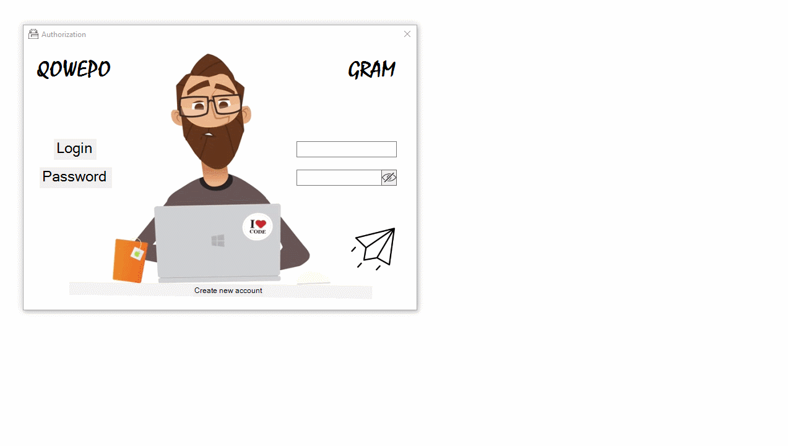

# Messenger on ASP.NET Core using REST API architecture

Implemented functionality: registration, authorization, general chat. User data is stored in MS SQL database.

Registration and authorization are implemented based on two different Post-requests to the LoginController controller. When requesting authorization, the server checks the presence of a login and password in the database; if entered correctly, a form with a chat opens. And when a registration request is made, the server checks the login for uniqueness.

The general chat is implemented based on a Post-request to the MessengerController controller, which adds the received Message to the List<Message> stored on the server. A get request using timer1_Tick, which asynchronously executes a request to the server every second, receives a new Message from the List<Message>.

Requests are sent and received in JSON format.

